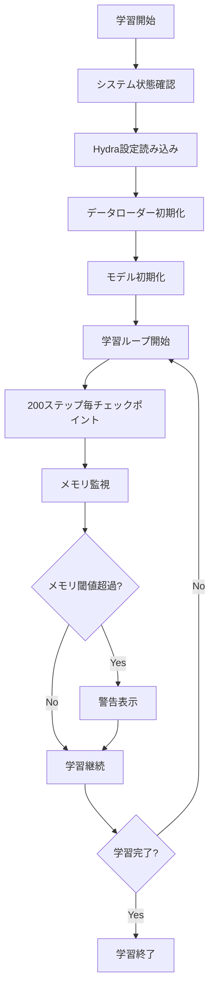

# SAM2.1 Food Segmentation Training Guide

SAM2.1を使用した食品セグメンテーション学習の完全ガイドです。データ統合から学習実行まで、全工程を詳細に説明しています。

## 📋 目次

1. [プロジェクト概要](#プロジェクト概要)
2. [環境要件](#環境要件)
3. [データセット統合](#データセット統合)
4. [学習実行](#学習実行)
5. [監視機能](#監視機能)
6. [トラブルシューティング](#トラブルシューティング)
7. [設定詳細](#設定詳細)

## 🎯 プロジェクト概要

このプロジェクトは、FoodSeg103とUEC-FoodPix Complete データセットを統合し、SAM2.1モデルでファインチューニングを行います。

### データセット構成
- **FoodSeg103**: 4,983サンプル（セマンティックセグメンテーション）
- **UEC-FoodPix Complete**: 10,000サンプル（バウンディングボックス）
- **統合後**: 17,118サンプル（SA-1B形式）

### 学習分割
- **Train**: 11,237サンプル（65.6%）
- **Validation**: 2,247サンプル（13.1%）  
- **Test**: 1,499サンプル（8.8%）

## 🔧 環境要件

### ハードウェア要件
- **GPU**: NVIDIA GPU（推奨: 12GB以上のVRAM）
- **CPU**: 4コア以上
- **メモリ**: 16GB以上（推奨: 32GB以上）
- **ストレージ**: 50GB以上の空き容量

### ソフトウェア要件
- **OS**: Linux（WSL2対応）
- **Python**: 3.10以上
- **CUDA**: 11.8以上（PyTorch 2.5.1対応）

### 主要依存関係
```bash
torch>=2.5.1
torchvision>=0.20.1
hydra-core>=1.3.2
fvcore>=0.1.5
pycocotools>=2.0.8
scikit-image>=0.24.0
```

## 📊 データセット統合

### 1. データセット統合スクリプト実行

前処理済みデータを統合してSAM2.1学習用のスプリットを作成します：

```bash
# 統合スクリプト実行（train/val/testスプリット作成）
python scripts/12_merge_to_sa1b.py

# 実行後の確認
ls -la data/foodmix_sa1b_splits/
# 出力例:
# train.txt    (11,237ファイル)
# val.txt      (2,247ファイル) 
# test.txt     (1,499ファイル)
# dataset_info.json
```

### 2. 統合結果の確認

```bash
# データセット情報の確認
cat data/foodmix_sa1b_splits/dataset_info.json

# スプリット内容確認
head -5 data/foodmix_sa1b_splits/train.txt
head -5 data/foodmix_sa1b_splits/val.txt
```

### 3. データ構造

統合後のデータ構造：
```
data/foodmix_sa1b/
├── images/                          # 画像ファイル（17,118枚）
│   ├── foodseg_train_xxxxx.jpg     # FoodSeg103画像
│   ├── uec_train_xxxxx.jpg         # UEC-FoodPix画像
│   └── uec_test_xxxxx.jpg          # UEC-FoodPixテスト画像
├── annotations/                     # SA-1BアノテーションJSON
│   ├── foodseg_train_xxxxx.json    # FoodSeg103アノテーション
│   ├── uec_train_xxxxx.json        # UEC-FoodPixアノテーション
│   └── uec_test_xxxxx.json         # UEC-FoodPixテストアノテーション
└── foodmix_sa1b_splits/            # 学習用スプリット
    ├── train.txt                   # 訓練用ファイルリスト
    ├── val.txt                     # 検証用ファイルリスト
    ├── test.txt                    # テスト用ファイルリスト
    └── dataset_info.json           # データセット統計情報
```

## 🚀 学習実行

### 1. 基本学習コマンド

```bash
# 最も基本的な学習実行
bash scripts/train_with_monitoring.sh --memory-optimized --auto-resume
```

### 2. 詳細な学習オプション

```bash
# 全オプション付きで実行
bash scripts/train_with_monitoring.sh \
  --memory-optimized \
  --auto-resume \
  --config sam2.1_training/sam2.1_hiera_b+_foodmix_optimized \
  --memory-threshold 85 \
  --gpu-memory-threshold 75 \
  --check-interval 30
```

### 3. コマンドラインオプション詳細

| オプション | 説明 | デフォルト値 | 例 |
|----------|------|------------|-----|
| `--memory-optimized` | メモリ最適化版学習スクリプト使用 | なし | 必須 |
| `--auto-resume` | 最新の実験から自動再開 | なし | 推奨 |
| `--config` | Hydra設定ファイル名 | `sam2.1_training/sam2.1_hiera_b+_foodmix_optimized` | 変更可能 |
| `--resume DIR` | 特定のディレクトリから再開 | なし | `--resume ./sam2_logs/experiment_20250906` |
| `--memory-threshold N` | CPU メモリ使用率閾値(%) | 90 | `--memory-threshold 85` |
| `--gpu-memory-threshold N` | GPU メモリ使用率閾値(%) | 80 | `--gpu-memory-threshold 75` |
| `--check-interval N` | 監視間隔（秒） | 30 | `--check-interval 60` |

### 4. 学習再開

```bash
# 自動検出で最新実験から再開
bash scripts/train_with_monitoring.sh --memory-optimized --auto-resume

# 特定の実験から再開
bash scripts/train_with_monitoring.sh --memory-optimized --resume ./sam2_logs/foodmix_optimized_20250906_123456

# カスタム設定で再開
bash scripts/train_with_monitoring.sh \
  --memory-optimized \
  --resume ./sam2_logs/custom_experiment \
  --memory-threshold 80
```

## 📈 監視機能

### 1. リアルタイム監視

学習中は以下の情報が30秒間隔で監視・表示されます：

```
[INFO] System status: CPU 45.2%, Memory 78.3%, GPU Memory 67.8%
[WARN] High CPU usage: 89.5%
[WARN] High GPU memory usage: 82.1%
```

### 2. ログファイル

```bash
# メインログファイル
tail -f training_monitor.log

# 学習ログファイル  
tail -f memory_optimized_training.log

# 特定実験のログ
tail -f ./sam2_logs/foodmix_optimized/logs/training.log
```

### 3. TensorBoard監視

```bash
# TensorBoard起動
tensorboard --logdir=./sam2_logs/foodmix_optimized/tensorboard --port=6006

# ブラウザで確認
# http://localhost:6006
```

## 🔄 学習フロー

### 1. 学習開始からチェックポイントまで



### 2. 典型的な学習進行

```bash
# 学習開始
[INFO] Starting new training with config: sam2.1_training/sam2.1_hiera_b+_foodmix_optimized
[INFO] Dataset images: /home/soya/sam2_1_food_finetuning/data/foodmix_sa1b/images
[INFO] Training list: /home/soya/sam2_1_food_finetuning/data/foodmix_sa1b_splits/train.txt
[INFO] Batch size: 1, Epochs: 40, Learning rate: 5e-06

# エポック進行
Epoch [1/40] Step [100/11237]: Loss: 2.457, IoU: 0.234, Memory: 67.2%
Epoch [1/40] Step [200/11237]: Loss: 2.123, IoU: 0.298, Memory: 68.5%
Epoch [1/40] Step [300/11237]: Loss: 1.876, IoU: 0.356, Memory: 69.1%

# チェックポイント保存
[INFO] Saving checkpoint at step 200: ./sam2_logs/foodmix_optimized/checkpoints/model_step_200.pt
```

## ⚙️ 設定詳細

### 1. メイン設定ファイル

設定ファイル場所：
```
external/sam2/sam2/configs/sam2.1_training/sam2.1_hiera_b+_foodmix_optimized.yaml
```

### 2. 主要パラメータ

#### 学習パラメータ
```yaml
scratch:
  resolution: 1024          # 入力画像解像度
  train_batch_size: 1       # バッチサイズ
  num_train_workers: 2      # データローダーワーカー数
  num_frames: 1             # フレーム数（静止画なので1）
  max_num_objects: 5        # 最大オブジェクト数
  base_lr: 5.0e-6          # ベース学習率
  vision_lr: 3.0e-6        # ビジョンエンコーダー学習率
  num_epochs: 40           # エポック数
```

#### データセット設定
```yaml
dataset:
  img_folder: /home/soya/sam2_1_food_finetuning/data/foodmix_sa1b/images
  gt_folder: /home/soya/sam2_1_food_finetuning/data/foodmix_sa1b/annotations  
  file_list_txt: /home/soya/sam2_1_food_finetuning/data/foodmix_sa1b_splits/train.txt
```

#### メモリ最適化設定
```yaml
memory_optimization:
  cleanup_freq: 25         # クリーンアップ頻度（ステップ）
  gc_freq: 10             # ガベージコレクション頻度  
  cpu_threshold: 80.0     # CPU使用率閾値
  gpu_threshold: 85.0     # GPU使用率閾値
```

### 3. カスタム設定作成

新しい設定を作成する場合：

```bash
# 既存設定をコピー
cp external/sam2/sam2/configs/sam2.1_training/sam2.1_hiera_b+_foodmix_optimized.yaml \
   external/sam2/sam2/configs/sam2.1_training/my_custom_config.yaml

# 設定を編集
vim external/sam2/sam2/configs/sam2.1_training/my_custom_config.yaml

# カスタム設定で学習実行
bash scripts/train_with_monitoring.sh --memory-optimized --config sam2.1_training/my_custom_config
```

## 🔧 トラブルシューティング

### 1. よくあるエラーと解決方法

#### GPU OutOfMemory エラー
```bash
# エラー例
RuntimeError: CUDA out of memory. Tried to allocate 2.00 GiB

# 解決方法 1: バッチサイズを削減
# 設定ファイルで train_batch_size: 1 → 1 のまま（最小）

# 解決方法 2: 解像度を削減  
# 設定ファイルで resolution: 1024 → 512

# 解決方法 3: ワーカー数削減
# 設定ファイルで num_train_workers: 2 → 1
```

#### Hydra設定エラー
```bash
# エラー例
MissingConfigException: Cannot find primary config 'sam2.1_training/missing_config'

# 解決方法
ls external/sam2/sam2/configs/sam2.1_training/  # 利用可能な設定確認
bash scripts/train_with_monitoring.sh --memory-optimized --config sam2.1_training/sam2.1_hiera_b+_foodmix_optimized
```

#### データセットパスエラー
```bash
# エラー例
FileNotFoundError: [Errno 2] No such file or directory: '/path/to/missing/file'

# 解決方法
python scripts/12_merge_to_sa1b.py  # データ統合を再実行
ls -la data/foodmix_sa1b_splits/    # スプリットファイル確認
```

### 2. システム要件チェック

```bash
# GPU確認
nvidia-smi

# メモリ確認
free -h

# ディスク容量確認  
df -h

# Python環境確認
/usr/bin/python3 -c "import torch; print(f'PyTorch: {torch.__version__}, CUDA: {torch.cuda.is_available()}')"
```

### 3. ログ分析

```bash
# エラーログ検索
grep -i "error\|exception\|failed" training_monitor.log

# メモリ使用量推移
grep "Memory" training_monitor.log | tail -20

# GPU使用量推移  
grep "GPU Memory" training_monitor.log | tail -20
```

## 📊 パフォーマンス最適化

### 1. メモリ最適化Tips

```bash
# 1. 最小限のバッチサイズ使用
train_batch_size: 1

# 2. ワーカー数削減
num_train_workers: 1

# 3. ガベージコレクション頻度増加
memory_optimization:
  gc_freq: 5  # デフォルト: 10

# 4. チェックポイント頻度調整
checkpoint:
  save_freq: 500  # デフォルト: 200 (メモリ解放頻度)
```

### 2. 学習速度最適化

```bash
# 1. 適切なワーカー数設定
num_train_workers: 2  # CPUコア数の半分程度

# 2. pin_memory有効化（メモリ十分な場合）
pin_memory: True

# 3. 混合精度学習確認
optim:
  amp:
    enabled: True
    amp_dtype: float16
```

### 3. 監視閾値調整

```bash
# 保守的な設定（安定性重視）
bash scripts/train_with_monitoring.sh \
  --memory-optimized \
  --memory-threshold 75 \
  --gpu-memory-threshold 70

# アグレッシブな設定（速度重視）  
bash scripts/train_with_monitoring.sh \
  --memory-optimized \
  --memory-threshold 95 \
  --gpu-memory-threshold 90
```

## 📁 出力ファイル構造

学習実行後の出力構造：

```
sam2_logs/
└── foodmix_optimized/                    # 実験ディレクトリ
    ├── config.yaml                       # 保存された設定
    ├── checkpoints/                      # モデルチェックポイント
    │   ├── model_step_200.pt            # 200ステップ時点
    │   ├── model_step_400.pt            # 400ステップ時点
    │   └── ...
    ├── tensorboard/                      # TensorBoard ログ
    │   └── events.out.tfevents.*
    └── logs/                            # 詳細ログ
        └── training.log
```

## 🎯 次のステップ

### 1. 学習完了後

```bash
# 最良チェックポイントの確認
ls -la sam2_logs/foodmix_optimized/checkpoints/

# 推論テスト
python scripts/inference_test.py --checkpoint sam2_logs/foodmix_optimized/checkpoints/best_model.pt

# 評価実行
python scripts/evaluate_model.py --test-split data/foodmix_sa1b_splits/test.txt
```

### 2. モデル改善

```bash
# ハイパーパラメータ調整
# - 学習率: base_lr, vision_lr
# - バッチサイズ: train_batch_size  
# - エポック数: num_epochs
# - 最大オブジェクト数: max_num_objects

# データ拡張調整
# vos.train_transforms 内の設定変更
```

### 3. 本格運用

```bash
# 長時間学習用スクリプト  
nohup bash scripts/train_with_monitoring.sh --memory-optimized --auto-resume > training.out 2>&1 &

# 定期的な監視
watch -n 60 "tail -5 training_monitor.log"
```

---

## 📞 サポート

問題が発生した場合：

1. **ログ確認**: `training_monitor.log`, `memory_optimized_training.log`
2. **システム状態**: `nvidia-smi`, `free -h`, `df -h`  
3. **設定確認**: 設定ファイルパスとパラメータ
4. **データ確認**: スプリットファイルと画像/アノテーション存在確認

このREADMEに従って実行すれば、SAM2.1による食品セグメンテーション学習が正常に実行できます。